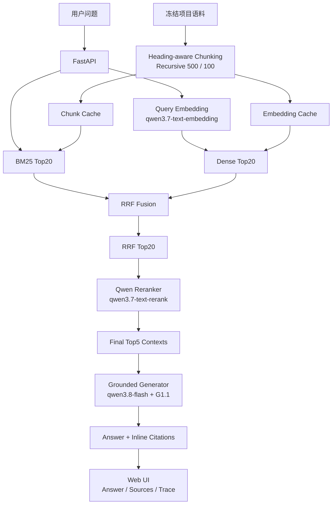

# Project Knowledge RAG

**[中文](./README.md) | [English](./README_EN.md)**

> 一个面向真实软件项目知识检索与面试式项目问答的 RAG 系统，强调固定 Benchmark、证据约束回答、来源引用，以及证据不足时的拒答能力。

**[在线 Demo](https://project-knowledge-rag.onrender.com)** · **[Swagger API](https://project-knowledge-rag.onrender.com/docs)** · **[实验文档](./evaluation/docs/)** · **[Benchmark](./benchmark/)**

> 在线 Demo 部署于 Render Free。长时间无访问后首次请求可能需要等待冷启动。

---

## 项目简介

Project Knowledge RAG 是一个用于**软件项目知识检索与面试式项目问答**的 Retrieval-Augmented Generation（RAG，检索增强生成）系统。

当前 V1 使用冻结语料 `P1-10MD-v1`，包含 10 篇真实项目 Markdown 文档，覆盖豆瓣电影大数据分析与可视化项目的数据处理、后端、前端、数据库、API、测试与用户使用说明等内容。

系统主要解决三个问题：

- 回答必须基于真实项目文档，而不是依赖模型自身记忆；
- 关键事实需要附带明确证据引用；
- 当现有语料无法支持问题核心信息时，应拒绝编造答案。

项目没有围绕少数示例问题反复调参，而是通过**固定 Benchmark、控制变量实验、回归 Trace 和明确的 Freeze 决策**选择最终 Retrieval 与 Generation Pipeline。

---

## 核心结果

### Retrieval

最终冻结的检索链路：

```text
Heading-aware Section
→ Recursive Chunking (500 / 100)
→ heading_path + content
→ BM25 Top20 + Dense Top20
→ RRF Top20
→ Qwen Reranker
→ Final Top5
```

| 指标 | 结果 |
| --- | ---: |
| Hit@5 | **97.78%** |
| Recall@5 | **90.74%** |
| MRR@5 | **77.48%** |
| Candidate K | **20** |
| Final K | **5** |
| Gold Evidence Chunk Coverage | **73 / 73（100%）** |

最高 Recall 的备选方案 `Recursive + Raw Union → Reranker` 达到 **91.48% Recall@5**，但平均需要 **31.71 个 Reranker 候选**。

最终冻结的 Heading-aware + RRF 方案只牺牲 **0.74 个百分点**的 Recall，却将 Reranker 候选规模减少约 **36.9%**，同时 MRR 更高（**77.48% vs. 77.07%**），因此作为效果、排序质量与候选预算之间的最终工程取舍。

### Generation

最终冻结的生成链路：

```text
Top5 Retrieved Contexts
→ G1.1 Grounded Prompt
→ qwen3.8-flash
→ JSON Answer + Inline [Sx] Citations
```

| 指标 | 结果 |
| --- | ---: |
| Answer Correctness | **93.61%** |
| Faithfulness | **94.29%** |
| Unsupported Claim Rate | **5.71%** |
| Citation Accuracy | **94.29%** |
| Citation Coverage | **95.61%** |
| Unanswerable Abstention | **5 / 5** |
| False Abstention | **0 / 45** |
| JSON Parse Success | **98%** |

---

## 系统架构



### Retrieval 输入

冻结后的 Heading-aware Pipeline 会为每个 Chunk 构造：

```text
heading_path
+
content
```

作为 Retrieval Representation。

因此标题层级信息会同时参与 BM25、Dense Retrieval 和 Reranker，而原始 `content` 继续作为最终提供给 Generator 的证据内容。

---

## Benchmark

Benchmark 在正式优化 Retrieval 与 Generation 之前，从冻结项目语料中构建。

| 项目 | 数量 |
| --- | ---: |
| Corpus Version | `P1-10MD-v1` |
| Benchmark Version | `v1` |
| 文档数 | **10** |
| 问题数 | **50** |
| 可回答问题 | **45** |
| 不可回答问题 | **5** |
| Gold Evidence | **73** |
| Single-hop | **26** |
| Multi-evidence | **19** |
| No-evidence | **5** |
| Cross-document | **7** |

问题类型覆盖 factual、parameter、module responsibility、data flow、architecture reasoning、implementation detail、cross-document 和 unanswerable。

Benchmark 同时经过自动验证和人工语义审核。Final Freeze Audit 曾发现 11 个 Evidence / Hop 标注问题，在正式 Freeze 前进行了定向修复，之后重新完成语义复核与 Validator 验证。

详细记录：

- [`benchmark/benchmark_quality_report.md`](./benchmark/benchmark_quality_report.md)
- [`benchmark/benchmark_coverage.md`](./benchmark/benchmark_coverage.md)
- [`benchmark/final_freeze_audit_report.md`](./benchmark/final_freeze_audit_report.md)
- [`benchmark/final_freeze_repair_report.md`](./benchmark/final_freeze_repair_report.md)

---

## Retrieval 实验

Retrieval Pipeline 不是预先堆叠组件得到的，而是根据固定 Benchmark 下的控制实验逐步收敛。

| 阶段 | Pipeline | Recall@5 | MRR@5 |
| --- | --- | ---: | ---: |
| E0 | Recursive 500/100 + BM25 Top5 | 60.74% | 34.59% |
| E1 | Recursive + Dense Top5 | 75.19% | 52.85% |
| E2 | Recursive + RRF Top5 | 71.85% | 55.15% |
| E3 | Recursive + RRF20 → Rerank5 | 89.26% | 76.93% |
| E4 | **Heading-aware + RRF20 → Rerank5** | **90.74%** | **77.48%** |
| E5 | Recursive + Raw Union → Rerank5 | **91.48%** | 77.07% |

几个关键实验结论：

1. **Dense Retrieval 整体优于 BM25，但不能直接替代 BM25。** Trace 分析发现，BM25 仍能补回部分 Dense 漏掉的词法证据，尤其是精确字段、代码标识符等查询。

2. **RRF 更适合作为 Candidate Generator，而不是 Final Ranker。** RRF Top20 提高了 Candidate Recall，但 RRF Top5 的 Recall 反而低于 Dense Top5。加入 Reranker 后，更好的候选集才真正转化为 Final Top5 收益。

3. **Heading-aware Chunking 在固定候选预算下提高了 Candidate Quality。** 在 `Candidate K = 20` 不变的情况下，Heading-aware RRF Top20 的 Candidate Recall 得到提升。

4. **没有机械选择最高 Recall 的 Pipeline。** Raw Union 虽然 Recall 更高，但显著扩大了 Reranker 输入规模。最终方案是效果、排序质量与候选预算之间的工程折中。

详细实验：

- [`1_RAG_Baseline_实验记录.md`](./evaluation/docs/1_RAG_Baseline_实验记录.md)
- [`2_RAG_Retrieval_Baseline后实验记录.md`](./evaluation/docs/2_RAG_Retrieval_Baseline后实验记录.md)
- [`3_RAG_Reranker_实验记录.md`](./evaluation/docs/3_RAG_Reranker_实验记录.md)
- [`4_RAG_Retrieval_Baseline_to_Freeze_实验总结_最终版.md`](./evaluation/docs/4_RAG_Retrieval_Baseline_to_Freeze_实验总结_最终版.md)

原始实验 Summary / Trace 保存在 [`evaluation/runs/retrieval`](./evaluation/runs/retrieval/)。

---

## Generation 实验

Generation 与 Retrieval 分开评估，并使用冻结的 Retrieval Context。

主要评价指标包括：

```text
Answer Correctness
Faithfulness / Unsupported Claim Rate
Abstention
Citation Accuracy / Citation Coverage
JSON Parse Success
Token Usage
Latency
```

### 实验演进

| 阶段 | Generator / Prompt | Correctness | Faithfulness | Abstention | Citation Coverage |
| --- | --- | ---: | ---: | ---: | ---: |
| E1 | 7B + naive G0 | 72.50% | 78.29% | 0 / 5 | 70.69% |
| E3 | 7B + strict G1 | 52.50% | 76.35% | 2 / 5 | 7.01% |
| E3.1 | 7B + refined G1.1 | 59.72% | 78.37% | 2 / 5 | 30.44% |
| E4 | **qwen3.8-flash + G1.1** | **93.61%** | **94.29%** | **5 / 5** | **95.61%** |

实验表明，Prompt 约束并不是越严格越好。

在较弱的 7B Generator 上，同时加强 Grounding、Abstention、Citation、JSON 等约束后出现了规则竞争、False Abstention 和 Citation Coverage 大幅下降。

G1.1 通过减少规则冲突有所改善，但真正的大幅提升来自 E4：保持 Prompt 和冻结 Context 不变，只替换 Generator 为 `qwen3.8-flash`。这一实验把 **Prompt Design 问题**与 **Model Capability Bottleneck（模型能力瓶颈）**区分开来。

工程侧还单独验证了异步化：在模型与 Prompt 不变的前提下，同步流程改为异步后，Generation Wall Time 约提升 **2.83×**，Evaluation Wall Time 约提升 **3.08×**。

详细实验：

- [`5_RAG_Generation_E1-E3_实验阶段总结.md`](./evaluation/docs/5_RAG_Generation_E1-E3_实验阶段总结.md)
- [`6_RAG_Generation_E3-E3.1_Prompt优化实验总结.md`](./evaluation/docs/6_RAG_Generation_E3-E3.1_Prompt优化实验总结.md)
- [`7_RAG_Generation_E4_模型升级实验总结.md`](./evaluation/docs/7_RAG_Generation_E4_模型升级实验总结.md)

原始输出、Summary 和 Eval Trace 保存在 [`evaluation/runs/generation`](./evaluation/runs/generation/)。

---

## Web Demo

V1 使用 FastAPI 封装冻结后的端到端 RAG Pipeline，并提供轻量 Web UI。

**在线访问：** https://project-knowledge-rag.onrender.com

页面展示：

```text
Question
→ Answer
→ Inline Citations
→ Top5 Retrieved Sources
→ Rerank Scores
→ Heading Paths
→ Evidence Context
→ Retrieval / Generation / Total Latency
→ Token Usage / Parse Status
```

当前 Demo 已支持：

- 对宽泛项目问题进行多文档证据整合；
- 对具体实现问题返回文件与章节级来源；
- 当 Top5 Context 无法支持问题核心信息时，返回 `根据现有资料无法确定。`，而不是补全不存在的实现细节。

V1 当前刻意保持为**单轮问答**，尚未加入 Query Rewrite 与多轮对话历史。

---

## 仓库结构

```text
Project-Knowledge-RAG/
├─ benchmark/                  # 固定 QA / Evidence Benchmark 与审计报告
├─ cache/
│  ├─ heading_corpus_chunks.jsonl
│  └─ heading_corpus_embeddings.npy
├─ corpus/                     # 冻结项目文档语料
├─ demo/
│  ├─ api.py                   # FastAPI 入口
│  ├─ cli.py                   # CLI 端到端 Demo
│  └─ static/index.html        # Web UI
├─ evaluation/
│  ├─ docs/                    # 实验总结
│  ├─ generation/              # Generation Evaluation
│  ├─ retrieval/               # Retrieval Evaluation
│  └─ runs/                    # 冻结实验输出 / Trace
├─ src/
│  ├─ generation/
│  ├─ ingestion/
│  └─ retrieval/
├─ .env.example
├─ .gitignore
└─ requirements.txt
```

---

## 本地运行

### 1. 安装依赖

```bash
pip install -r requirements.txt
```

### 2. 配置环境变量

根据 `.env.example` 创建 `.env`：

```env
DASHSCOPE_API_KEY=your_api_key
DASHSCOPE_BASE_URL=https://dashscope.aliyuncs.com/compatible-mode/v1
```

### 3. CLI Demo

```bash
python -m demo.cli
```

### 4. Web Demo

```bash
python -m uvicorn demo.api:app --host 127.0.0.1 --port 8000
```

访问：

```text
http://127.0.0.1:8000
```

Swagger：

```text
http://127.0.0.1:8000/docs
```

---

## 部署

V1 使用 Render Web Service，并连接 GitHub `main` 分支。

```text
GitHub main
→ Render Build
→ pip install -r requirements.txt
→ uvicorn demo.api:app --host 0.0.0.0 --port $PORT
→ Public FastAPI / Web Demo
```

API Key 等运行时密钥通过 Render Environment Variables 管理，不提交到 GitHub。

`main` 分支更新后可以自动触发重新部署。

---

## 当前边界

V1 有意保持小而透明：

- 仅支持单轮问答；
- 尚未加入 Query Rewrite / Conversational Contextualization；
- 当前只有一个冻结项目语料；
- Chunk 与 Corpus Embedding 仍使用文件缓存；
- 尚未接入 PostgreSQL / pgvector；
- Render Free 长时间无访问后存在冷启动。

这些是当前版本明确的工程边界，不是 Benchmark 能力结论。

---

## Roadmap

```text
V1  Single-turn Web RAG Demo                         ✅
V2  Query Rewrite + Multi-turn Context
V3  PostgreSQL + pgvector for documents/chunks/vectors
V4  Multi-project Corpus
V5  Code-aware Retrieval
V6  Incremental Ingestion / Knowledge Management
```

V1 冻结的 Retrieval / Generation 实验会继续作为后续版本的可复现 Baseline。

---

## 实验原则

项目在实验过程中遵循以下原则：

- Benchmark 一旦冻结，不因为 Retrieval 失败而修改题目迎合结果；
- 尽可能一次只改变一个主要实验变量；
- 区分 Candidate Recall 与 Final Ranking Quality；
- 使用固定 Benchmark 和 Regression Trace，而不是围绕单个 Query 调 Prompt；
- 保留失败实验与负结果，用它们解释后续工程决策；
- 当证据已经足够支持工程选择时停止继续优化。

---

## License

当前仓库**未提供开源许可证**。
