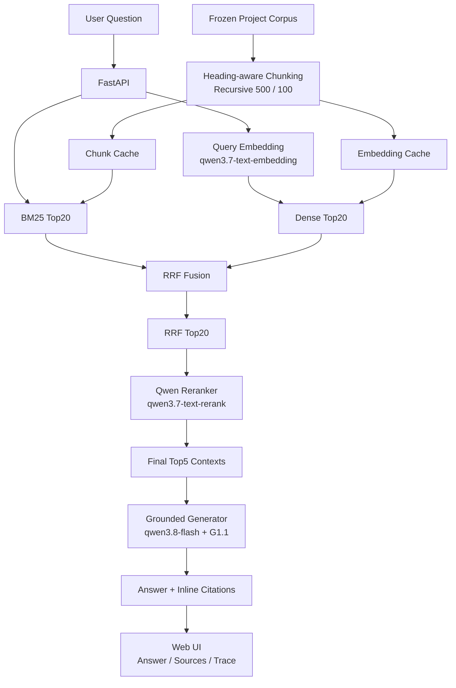

# Project Knowledge RAG

**English | [中文](./README.md)**

> A benchmark-driven Retrieval-Augmented Generation system for querying real software-project knowledge with evidence-grounded answers, source citations, and abstention when evidence is insufficient.

**[Live Demo](https://project-knowledge-rag.onrender.com)** · **[Swagger API](https://project-knowledge-rag.onrender.com/docs)** · **[Evaluation Docs](./evaluation/docs/)** · **[Benchmark](./benchmark/)**

> The public demo runs on Render Free. After a period of inactivity, the first request may require a cold start.

---

## Overview

Project Knowledge RAG is a RAG system built for **software-project knowledge retrieval and interview-style project Q&A**.

The current V1 corpus is `P1-10MD-v1`, a frozen 10-document project corpus covering the data, backend, frontend, database, API, testing, and user-facing behavior of a Douban movie big-data analysis and visualization project.

The system is designed around three requirements:

- retrieve evidence from real project documentation instead of answering from model memory;
- attach evidence citations to key claims;
- abstain when the available project context does not support the core answer.

Rather than optimizing against a few hand-picked questions, the project uses a **fixed benchmark, controlled experiments, regression traces, and explicit freeze decisions** to select the final retrieval and generation pipeline.

---

## Key Results

### Retrieval

Final frozen pipeline:

```text
Heading-aware Section
→ Recursive Chunking (500 / 100)
→ heading_path + content
→ BM25 Top20 + Dense Top20
→ RRF Top20
→ Qwen Reranker
→ Final Top5
```

| Metric | Result |
| --- | ---: |
| Hit@5 | **97.78%** |
| Recall@5 | **90.74%** |
| MRR@5 | **77.48%** |
| Candidate K | **20** |
| Final K | **5** |
| Gold Evidence Chunk Coverage | **73 / 73 (100%)** |

The highest-recall alternative, `Recursive + Raw Union → Reranker`, reached **91.48% Recall@5**, but required an average of **31.71 reranker candidates**. The frozen Heading-aware + RRF pipeline gives up only **0.74 percentage points** of Recall while reducing the reranker candidate set by about **36.9%** and achieving slightly higher MRR (**77.48% vs. 77.07%**).

### Generation

Final frozen generator:

```text
Top5 Retrieved Contexts
→ G1.1 Grounded Prompt
→ qwen3.8-flash
→ JSON Answer + Inline [Sx] Citations
```

| Metric | Result |
| --- | ---: |
| Answer Correctness | **93.61%** |
| Faithfulness | **94.29%** |
| Unsupported Claim Rate | **5.71%** |
| Citation Accuracy | **94.29%** |
| Citation Coverage | **95.61%** |
| Unanswerable Abstention | **5 / 5** |
| False Abstention | **0 / 45** |
| JSON Parse Success | **98%** |

---

## Architecture



### Retrieval input

For the frozen Heading-aware pipeline, each chunk carries:

```text
heading_path
+
content
```

as its retrieval representation. The heading hierarchy is therefore available to BM25, Dense Retrieval, and the Reranker, while the original chunk content remains the evidence payload presented to the generator.

---

## Benchmark

The benchmark was constructed from the frozen project corpus before retrieval and generation optimization.

| Item | Value |
| --- | ---: |
| Corpus Version | `P1-10MD-v1` |
| Benchmark Version | `v1` |
| Documents | **10** |
| Questions | **50** |
| Answerable | **45** |
| Unanswerable | **5** |
| Gold Evidence Segments | **73** |
| Single-hop | **26** |
| Multi-evidence | **19** |
| No-evidence | **5** |
| Cross-document Questions | **7** |

Question types include factual queries, parameters, module responsibilities, data flow, architecture reasoning, implementation details, cross-document reasoning, and deliberately unanswerable questions.

The benchmark went through both automated validation and manual semantic review. A final freeze audit identified 11 evidence / hop-label issues; these were repaired before formal freeze, followed by another semantic review and validator pass.

See:

- [`benchmark/benchmark_quality_report.md`](./benchmark/benchmark_quality_report.md)
- [`benchmark/benchmark_coverage.md`](./benchmark/benchmark_coverage.md)
- [`benchmark/final_freeze_audit_report.md`](./benchmark/final_freeze_audit_report.md)
- [`benchmark/final_freeze_repair_report.md`](./benchmark/final_freeze_repair_report.md)

---

## Retrieval Experiments

The retrieval pipeline was selected through controlled experiments rather than by adding components up front.

| Stage | Pipeline | Recall@5 | MRR@5 |
| --- | --- | ---: | ---: |
| E0 | Recursive 500/100 + BM25 Top5 | 60.74% | 34.59% |
| E1 | Recursive + Dense Top5 | 75.19% | 52.85% |
| E2 | Recursive + RRF Top5 | 71.85% | 55.15% |
| E3 | Recursive + RRF20 → Rerank5 | 89.26% | 76.93% |
| E4 | **Heading-aware + RRF20 → Rerank5** | **90.74%** | **77.48%** |
| E5 | Recursive + Raw Union → Rerank5 | **91.48%** | 77.07% |

Several engineering decisions came directly from these experiments:

1. **Dense Retrieval outperformed BM25 overall, but did not replace it.** Trace analysis showed that BM25 still recovered lexical evidence missed by Dense Retrieval, especially exact fields and identifiers.
2. **RRF is useful as a candidate generator, not as the final ranker.** RRF Top20 improved candidate recall, but RRF Top5 underperformed Dense Top5 on Recall. Adding a reranker converted the stronger candidate set into a large Final Top5 improvement.
3. **Heading-aware Chunking improved candidate quality under a fixed budget.** Heading-aware RRF Top20 increased candidate Recall@20 while keeping `Candidate K = 20`.
4. **The maximum-Recall pipeline was not automatically selected.** Raw Union slightly improved Recall but expanded the reranker candidate pool substantially. The final frozen pipeline was chosen as an effect / ranking-quality / candidate-budget tradeoff.

Detailed retrieval records:

- [`1_RAG_Baseline_实验记录.md`](./evaluation/docs/1_RAG_Baseline_实验记录.md)
- [`2_RAG_Retrieval_Baseline后实验记录.md`](./evaluation/docs/2_RAG_Retrieval_Baseline后实验记录.md)
- [`3_RAG_Reranker_实验记录.md`](./evaluation/docs/3_RAG_Reranker_实验记录.md)
- [`4_RAG_Retrieval_Baseline_to_Freeze_实验总结_最终版.md`](./evaluation/docs/4_RAG_Retrieval_Baseline_to_Freeze_实验总结_最终版.md)

Raw experiment outputs and traces are retained under [`evaluation/runs/retrieval`](./evaluation/runs/retrieval/).

---

## Generation Experiments

Generation was evaluated separately from retrieval using frozen contexts.

The main evaluated dimensions were:

```text
Answer Correctness
Faithfulness / Unsupported Claim Rate
Abstention
Citation Accuracy / Citation Coverage
JSON Parse Success
Token Usage
Latency
```

### Experiment progression

| Stage | Generator / Prompt | Correctness | Faithfulness | Abstention | Citation Coverage |
| --- | --- | ---: | ---: | ---: | ---: |
| E1 | 7B + naive G0 | 72.50% | 78.29% | 0 / 5 | 70.69% |
| E3 | 7B + strict G1 | 52.50% | 76.35% | 2 / 5 | 7.01% |
| E3.1 | 7B + refined G1.1 | 59.72% | 78.37% | 2 / 5 | 30.44% |
| E4 | **qwen3.8-flash + G1.1** | **93.61%** | **94.29%** | **5 / 5** | **95.61%** |

A strict prompt did not automatically improve quality. On the weaker 7B generator, stronger grounding / abstention / citation constraints caused rule competition, false abstention, and severe citation-coverage degradation.

The G1.1 refinement reduced this failure mode, but the large E4 improvement only appeared after changing the generator while keeping the prompt and frozen contexts fixed. This separated **prompt-design limitations** from a **model-capability bottleneck**.

An earlier engineering experiment also changed synchronous generation/evaluation to asynchronous execution without changing the prompt or model, reducing measured wall time by roughly **2.83× for generation** and **3.08× for evaluation**.

Detailed generation records:

- [`5_RAG_Generation_E1-E3_实验阶段总结.md`](./evaluation/docs/5_RAG_Generation_E1-E3_实验阶段总结.md)
- [`6_RAG_Generation_E3-E3.1_Prompt优化实验总结.md`](./evaluation/docs/6_RAG_Generation_E3-E3.1_Prompt优化实验总结.md)
- [`7_RAG_Generation_E4_模型升级实验总结.md`](./evaluation/docs/7_RAG_Generation_E4_模型升级实验总结.md)

Raw outputs, summaries, and evaluator traces are retained under [`evaluation/runs/generation`](./evaluation/runs/generation/).

---

## Web Demo

The V1 demo exposes the frozen pipeline through FastAPI and a lightweight web interface.

**Live:** https://project-knowledge-rag.onrender.com

The UI displays:

```text
Question
→ Answer
→ Inline Citations
→ Top5 Retrieved Sources
→ Rerank Scores
→ Heading Paths
→ Evidence Context
→ Retrieval / Generation / Total Latency
→ Token Usage / Parse Status
```

Example behavior:

- broad project questions can synthesize evidence across retrieved project documents;
- implementation questions can cite concrete project files and sections;
- when the retrieved context does not support the core answer, the generator can return `根据现有资料无法确定。` instead of inventing an implementation.

The current public demo is intentionally **single-turn**. Query Rewrite and conversational history are not part of V1.

---

## Repository Structure

```text
Project-Knowledge-RAG/
├─ benchmark/                  # Fixed QA / evidence benchmark and audit reports
├─ cache/
│  ├─ heading_corpus_chunks.jsonl
│  └─ heading_corpus_embeddings.npy
├─ corpus/                     # Frozen project-document corpus
├─ demo/
│  ├─ api.py                   # FastAPI entry point
│  ├─ cli.py                   # CLI end-to-end demo
│  └─ static/index.html        # Lightweight Web UI
├─ evaluation/
│  ├─ docs/                    # Experiment summaries
│  ├─ generation/              # Generation evaluation code
│  ├─ retrieval/               # Retrieval evaluation code
│  └─ runs/                    # Frozen experiment outputs / traces
├─ src/
│  ├─ generation/
│  ├─ ingestion/
│  └─ retrieval/
├─ .env.example
├─ .gitignore
└─ requirements.txt
```

---

## Run Locally

### 1. Install dependencies

```bash
pip install -r requirements.txt
```

### 2. Configure environment

Create `.env` from `.env.example`:

```env
DASHSCOPE_API_KEY=your_api_key
DASHSCOPE_BASE_URL=https://dashscope.aliyuncs.com/compatible-mode/v1
```

### 3. Run the CLI demo

```bash
python -m demo.cli
```

### 4. Run the Web demo

```bash
python -m uvicorn demo.api:app --host 127.0.0.1 --port 8000
```

Open:

```text
http://127.0.0.1:8000
```

Swagger:

```text
http://127.0.0.1:8000/docs
```

---

## Deployment

V1 is deployed as a Render Web Service connected to the `main` branch.

```text
GitHub main
→ Render Build
→ pip install -r requirements.txt
→ uvicorn demo.api:app --host 0.0.0.0 --port $PORT
→ Public FastAPI / Web Demo
```

Runtime secrets are configured through Render Environment Variables rather than committed to Git.

Pushes to `main` can trigger automatic redeployment.

---

## Current Limitations

V1 deliberately keeps the online system small and inspectable:

- single-turn question answering only;
- no Query Rewrite / conversational contextualization yet;
- one frozen software-project corpus;
- chunks and corpus embeddings are currently file-based caches;
- no PostgreSQL / pgvector persistence layer yet;
- the free Render instance can cold-start after inactivity.

These are known scope boundaries rather than benchmark claims.

---

## Roadmap

Planned engineering extensions:

```text
V1  Single-turn Web RAG Demo                         ✅
V2  Query Rewrite + Multi-turn Context
V3  PostgreSQL + pgvector for documents/chunks/vectors
V4  Multi-project Corpus
V5  Code-aware Retrieval
V6  Incremental Ingestion / Knowledge Management
```

The frozen V1 retrieval and generation experiments remain reproducible baselines for later versions.

---

## Experimental Principles

This project follows several rules intended to keep results interpretable:

- freeze the benchmark instead of editing it to fit retrieval failures;
- change one major experimental variable at a time where possible;
- separate candidate recall from final ranking quality;
- use fixed benchmarks and regression traces instead of tuning around one query;
- keep failed experiments and negative results when they explain an engineering decision;
- stop optimization when the evidence is sufficient for an engineering choice.

---

## License

This repository currently does **not** provide an open-source license.
