# 电影分析管理平台 —— 数据库设计文档

> 数据库名：`movie_stat_db`
> 建表脚本：`src/db/movie_stat_db.sql`
> 测试数据脚本：`src/db/stat_*.sql`（共 13 个）
> 引擎 / 字符集：`InnoDB` / `utf8mb4`（`utf8mb4_unicode_ci`）

---

## 一、功能概述

### 1.1 项目定位

`MovieAnalysisAPI`（电影分析管理平台）是一个**大数据可视化分析系统**的后端数据服务。它对豆瓣电影原始数据集进行多维度统计分析，将统计结果持久化到 MySQL，并对外提供 REST 接口，供前端 ECharts 图表消费。

### 1.2 整体数据链路

系统采用「离线计算 + 结果入库 + 在线查询」的经典大数据架构，各张数据表本质上是**离线统计的结果表（ADS 层）**，而非原始明细表。

```
原始电影数据(CSV)
      │
      ▼
PySpark 离线统计 (MovieAnalysis.py)   ── 13 个统计功能
      │  结果列: 个数/顺序/类型 与建表字段严格一致
      ▼
HDFS 落盘  /movies/analysis_results/<表名>/   (CSV, 无表头, 逗号分隔)
      │
      ▼
Sqoop 导出 export ( --fields-terminated-by ',' )
      │
      ▼
MySQL  movie_stat_db  (13 张 stat_* 结果表)
      │
      ▼
Spring Boot + MyBatis-Plus (Entity/Mapper/Service/Controller)
      │
      ▼
REST API ──▶ 前端 ECharts 可视化
```

### 1.3 关键设计约束

1. **结果 CSV 无表头**，Sqoop 按列顺序导入，因此各表字段顺序必须与统计结果的列顺序完全一致，**不可调整**。
2. Sqoop 导出命令的 `--fields-terminated-by ','` 需与 `MovieAnalysis.py` 中的 `CSV_SEP = ","` 保持一致。
3. 含特殊字符（英文逗号、引号、冒号等）的文本字段（如电影名）在 Sqoop 导出时曾因引号处理不当导致丢行（功能 B 曾因此缺失 149 行），导出时应确保 `--input-optionally-enclosed-by '"'` 与 Spark 写出侧的 `quote/escape` 严格配对，并**以行数校验作为导出后的固定检查步骤**。
4. 每张表名与结果导出到 HDFS 时的子文件夹名一致（如 `/movies/analysis_results/stat_movie_year/` → 表 `stat_movie_year`）。
5. **功能 5**（按上映年份统计电影数量 SQL 版）仅注册临时视图、不落盘，因此**无需建表**。

### 1.4 统计功能清单

| 功能编号 | 功能名称 | 实现方式 | 对应数据表 | 可视化用途 |
| --- | --- | --- | --- | --- |
| 功能 1 | 每年电影数量 | Spark Core | `stat_movie_year` | 产量趋势 |
| 功能 2 | 高分电影平均分 | Spark Core | `stat_high_score_avg` | 单值指标 |
| 功能 3 | 电影时长分布（最长/最短/平均） | Spark Core | `stat_mins_total` | 单值指标 |
| 功能 4 | 不同地区电影数量 | Spark Core | `stat_region_count` | 地区分布 |
| 功能 5 | 按上映年份统计电影数量（SQL 版） | SparkSQL | —（不落盘） | 与功能 1 对比演示 |
| 功能 6 | 按评分区间统计电影数量 | SparkSQL | `stat_score_section` | 饼图/柱状图 |
| 功能 7 | 地域发行量 Top50 | SparkSQL | `stat_region_top50` | 排行榜 |
| 功能 8 | 每年各国发行量对比 | SparkSQL | `stat_year_region_count` | 堆叠柱状图/热力图 |
| 功能 9 | 各国每年平均评分 | SparkSQL | `stat_region_year_avg_score` | 质量趋势 |
| 功能 10 | 电影语言类型统计 | SparkSQL | `stat_language` | 语言分布 |
| 功能 A | 各电影类型数量统计 | SparkSQL | `stat_genre_count` | ECharts 饼图/柱状图 |
| 功能 B | 每年评分 Top20 电影 | SparkSQL | `stat_year_top20_movie` | 排行榜/条形图 |
| 功能 C | 演员参演电影数量 Top50 | SparkSQL | `stat_actor_top50` | 高产演员条形图 |
| 功能 F | 各年代平均片长变化趋势 | SparkSQL | `stat_year_avg_mins` | 折线图 |

---

## 二、数据库设计

### 2.1 建库语句

```sql
CREATE DATABASE IF NOT EXISTS movie_stat_db
    DEFAULT CHARACTER SET utf8mb4
    DEFAULT COLLATE utf8mb4_unicode_ci;

USE movie_stat_db;
```

- 采用 `utf8mb4` 字符集，完整支持中文、多语言地区名/语言名及 Emoji。
- 排序规则 `utf8mb4_unicode_ci`，保证多语言文本比较的一致性。

### 2.2 设计原则

| 维度 | 设计决策 |
| --- | --- |
| 表性质 | 全部为**统计结果表（宽表/聚合表）**，一行即一个统计结果，非规范化明细表 |
| 主键 | 单值结果表使用常量主键 `stat_id`（固定为 1）；其余结果表无显式主键，字段顺序对齐 Sqoop 列序 |
| 外键 | 结果表之间**不设物理外键**，仅存在逻辑维度关联（见第六章） |
| 引擎 | 统一 `InnoDB`，支持事务与行级锁 |
| 字段类型映射 | Spark `int`→`INT`，`bigint`→`BIGINT`，`double`→`DOUBLE`，`string`→`VARCHAR(n)` |
| 命名 | 表名 `stat_` 前缀 + 语义；字段名小写下划线；均带 `COMMENT` |

### 2.3 类型映射对照

| Spark 结果类型 | MySQL 类型 | 说明 |
| --- | --- | --- |
| `int` | `INT` | 年份、常量主键等 |
| `bigint` | `BIGINT` | 计数、求和等大整数值 |
| `double` | `DOUBLE` | 平均分、平均片长等浮点值 |
| `string` | `VARCHAR(20~200)` | 地区名、语言名、类型名、片名等文本 |

---

## 三、数据表设计

共 **13 张表**。以下逐表给出字段含义、类型与约束。所有表均为 `ENGINE=InnoDB DEFAULT CHARSET=utf8mb4`。

### 3.1 `stat_movie_year` —— 功能 1 · 每年电影数量

统计每个上映年份发行的电影数量，用于分析电影产量随年份的变化趋势。过滤 `YEAR` 为空或为 0 的记录后按年份分组计数（注意：该条件无法拦截 "2049" 等异常脏年份，测试数据中含 `movie_year = 2049` 一行）。

| 字段 | 类型 | 约束 | 含义 |
| --- | --- | --- | --- |
| `movie_year` | `INT` | 业务主键（逻辑） | 上映年份 |
| `movie_count` | `BIGINT` | — | 该年份的电影数量 |

> 结果列顺序：`movie_year(int), movie_count(bigint)`；HDFS：`/movies/analysis_results/stat_movie_year/`

### 3.2 `stat_high_score_avg` —— 功能 2 · 高分电影平均分

统计豆瓣评分 ≥ 7.5 的高分电影平均分，结果固定为单行单值。

| 字段 | 类型 | 约束 | 含义 |
| --- | --- | --- | --- |
| `stat_id` | `INT` | 常量主键，固定为 1 | 结果行标识 |
| `high_score_avg` | `DOUBLE` | — | 高分电影（评分 ≥ 7.5）的平均分 |

### 3.3 `stat_mins_total` —— 功能 3 · 电影时长分布

统计全部电影片长的最长值、最短值与平均值，结果固定为单行。过滤 `MINS <= 0` 的缺失记录。

| 字段 | 类型 | 约束 | 含义 |
| --- | --- | --- | --- |
| `stat_id` | `INT` | 常量主键，固定为 1 | 结果行标识 |
| `max_mins` | `DOUBLE` | — | 最长片长（分钟） |
| `min_mins` | `DOUBLE` | — | 最短片长（分钟） |
| `avg_mins` | `DOUBLE` | — | 平均片长（分钟） |

### 3.4 `stat_region_count` —— 功能 4 · 不同地区电影数量

统计各制片国家/地区的电影数量，按数量降序。多值字段 `REGIONS` 按 `' / '` 拆分展开（explode）后分组计数。

| 字段 | 类型 | 约束 | 含义 |
| --- | --- | --- | --- |
| `region_name` | `VARCHAR(100)` | — | 制片国家/地区名称 |
| `movie_cnt` | `BIGINT` | — | 该地区的电影数量 |

### 3.5 `stat_score_section` —— 功能 6 · 按评分区间统计电影数量

将豆瓣评分按区间分桶后统计各区间电影数量，用于评分分布饼图/柱状图。`CASE WHEN` 离散化为 `0-6分 / 6-8分 / 8-10分 / 无评分`。

| 字段 | 类型 | 约束 | 含义 |
| --- | --- | --- | --- |
| `score_section` | `VARCHAR(20)` | — | 评分区间（0-6分/6-8分/8-10分/无评分） |
| `movie_count` | `BIGINT` | — | 该评分区间的电影数量 |

> 说明：设计上定义了 4 个区间，但实际测试数据（`stat_score_section.sql`）仅包含 `0-6分`、`8-10分`、`6-8分` 三行，无 `无评分` 行，前端绘图时需按需补零。

### 3.6 `stat_region_top50` —— 功能 7 · 地域发行量 Top50

电影发行量最多的前 50 个制片国家/地区及其发行量。拆分 `REGIONS` 后分组计数，按数量降序取前 50。

| 字段 | 类型 | 约束 | 含义 |
| --- | --- | --- | --- |
| `region_name` | `VARCHAR(100)` | — | 制片国家/地区名称 |
| `total` | `BIGINT` | — | 该地区电影发行量（电影数量） |

### 3.7 `stat_year_region_count` —— 功能 8 · 每年各国发行量对比

二维统计（年份 × 地区）各地区的电影产量，用于堆叠柱状图/热力图。拆分 `REGIONS` 后按 `(年份, 地区)` 分组计数（`YEAR` 仅过滤 0/NULL，测试数据中含 `movie_year = 2049` 的 3 行）。

| 字段 | 类型 | 约束 | 含义 |
| --- | --- | --- | --- |
| `movie_year` | `INT` | 联合维度 | 上映年份 |
| `region_name` | `VARCHAR(100)` | 联合维度 | 制片国家/地区名称 |
| `region_year_count` | `BIGINT` | — | 该年份该地区的电影数量 |

### 3.8 `stat_region_year_avg_score` —— 功能 9 · 各国每年平均评分

二维统计（地区 × 年份）各地区每年电影的平均豆瓣评分，反映"质量"变化。过滤无评分记录。

| 字段 | 类型 | 约束 | 含义 |
| --- | --- | --- | --- |
| `region_name` | `VARCHAR(100)` | 联合维度 | 制片国家/地区名称 |
| `movie_year` | `INT` | 联合维度 | 上映年份 |
| `region_score_avg` | `DOUBLE` | — | 该地区该年份电影的平均豆瓣评分 |

### 3.9 `stat_language` —— 功能 10 · 电影语言类型统计

统计使用各语言拍摄的电影数量，按数量降序。多值字段 `LANGUAGES` 按 `' / '` 拆分展开后分组计数。

| 字段 | 类型 | 约束 | 含义 |
| --- | --- | --- | --- |
| `language_name` | `VARCHAR(100)` | — | 语言名称（如 汉语普通话） |
| `language_count` | `BIGINT` | — | 该语言的电影数量 |

### 3.10 `stat_genre_count` —— 功能 A · 各电影类型数量统计

统计各电影类型的数量，用于 ECharts 饼图/柱状图展示类型分布。多值字段 `GENRES` 按 `'/'` 拆分展开后分组计数，按数量降序。

| 字段 | 类型 | 约束 | 含义 |
| --- | --- | --- | --- |
| `genre_name` | `VARCHAR(50)` | — | 电影类型名称（如 喜剧） |
| `genre_count` | `BIGINT` | — | 该类型的电影数量 |

### 3.11 `stat_year_top20_movie` —— 功能 B · 每年评分 Top20 电影

每个年份豆瓣评分最高的前 20 部电影，用于排行榜/条形图。窗口函数 `row_number()` 按年份分区、评分降序排名，取 `rn <= 20`。

| 字段 | 类型 | 约束 | 含义 |
| --- | --- | --- | --- |
| `movie_year` | `INT` | 分区维度 | 上映年份 |
| `MOVIE_ID` | `VARCHAR(32)` | — | 电影 ID（对应豆瓣 DOUBAN_ID） |
| `NAME` | `VARCHAR(200)` | — | 电影名称 |
| `DOUBAN_SCORE` | `DOUBLE` | — | 豆瓣评分 |
| `DOUBAN_VOTES` | `VARCHAR(32)` | 文本 | 豆瓣投票数（代码中未做 cast，仍为字符串） |

> ⚠️ 注意：`DOUBAN_VOTES` 因未做类型转换，结果仍为字符串类型，故建为 `VARCHAR(32)` 而非数值类型。

### 3.12 `stat_actor_top50` —— 功能 C · 演员参演电影数量 Top50

参演电影数量最多的前 50 名演员，用于条形图展示高产演员。`ACTOR_IDS` 按 `'|'` 拆分、取 `':'` 前的演员姓名后分组计数，取前 50。

| 字段 | 类型 | 约束 | 含义 |
| --- | --- | --- | --- |
| `person_name` | `VARCHAR(100)` | — | 演员姓名 |
| `acted_movie_cnt` | `BIGINT` | — | 该演员参演的电影数量 |

### 3.13 `stat_year_avg_mins` —— 功能 F · 各年代平均片长变化趋势

各年份电影的平均片长，用于折线图展示片长随年份的变化趋势。过滤 `MINS <= 0` 后按年份分组求片长均值，按年份升序。

| 字段 | 类型 | 约束 | 含义 |
| --- | --- | --- | --- |
| `movie_year` | `INT` | 业务主键（逻辑） | 上映年份 |
| `avg_mins_year` | `DOUBLE` | — | 该年份电影的平均片长（分钟） |

---

## 四、测试数据的插入

### 4.1 数据文件与规模

测试数据以独立 `.sql` 文件存放于 `src/db/`，每个文件对应一张表，内容为多条 `INSERT` 语句（真实统计结果样本）。

| 数据表 | 数据文件 | 插入行数 |
| --- | --- | --- |
| `stat_movie_year` | `stat_movie_year.sql` | 136 |
| `stat_high_score_avg` | `stat_high_score_avg.sql` | 1 |
| `stat_mins_total` | `stat_mins_total.sql` | 1 |
| `stat_region_count` | `stat_region_count.sql` | 507 |
| `stat_score_section` | `stat_score_section.sql` | 3 |
| `stat_region_top50` | `stat_region_top50.sql` | 50 |
| `stat_year_region_count` | `stat_year_region_count.sql` | 5421 |
| `stat_region_year_avg_score` | `stat_region_year_avg_score.sql` | 2399 |
| `stat_language` | `stat_language.sql` | 857 |
| `stat_genre_count` | `stat_genre_count.sql` | 55 |
| `stat_year_top20_movie` | `stat_year_top20_movie.sql` | 1968 |
| `stat_actor_top50` | `stat_actor_top50.sql` | 50 |
| `stat_year_avg_mins` | `stat_year_avg_mins.sql` | 124 |
| **合计** | **13 个文件** | **11572** |

### 4.2 插入语句格式

各文件均采用**显式列名**的 `INSERT` 语法，形如：

```sql
insert into movie_stat_db.<表名> (<列1>, <列2>, ...) values (<值1>, <值2>, ...);
```

### 4.3 各表数据样例

**功能 1 · 每年电影数量**
```sql
insert into movie_stat_db.stat_movie_year (movie_year, movie_count) values (1873, 1);
insert into movie_stat_db.stat_movie_year (movie_year, movie_count) values (1898, 10);
insert into movie_stat_db.stat_movie_year (movie_year, movie_count) values (1915, 105);
```

**功能 2 · 高分电影平均分**（单行）
```sql
insert into movie_stat_db.stat_high_score_avg (stat_id, high_score_avg) values (1, 8.015465249856296);
```

**功能 3 · 电影时长分布**（单行）
```sql
insert into movie_stat_db.stat_mins_total (stat_id, max_mins, min_mins, avg_mins)
    values (1, 14400, 1, 93.79993329316578);
```

**功能 6 · 评分区间分布**
```sql
insert into movie_stat_db.stat_score_section (score_section, movie_count) values ('0-6分', 121229);
insert into movie_stat_db.stat_score_section (score_section, movie_count) values ('8-10分', 3211);
insert into movie_stat_db.stat_score_section (score_section, movie_count) values ('6-8分', 16062);
```

**功能 7 · 地域发行量 Top50**（节选）
```sql
insert into movie_stat_db.stat_region_top50 (region_name, total) values ('美国', 42112);
insert into movie_stat_db.stat_region_top50 (region_name, total) values ('中国大陆', 15288);
insert into movie_stat_db.stat_region_top50 (region_name, total) values ('日本', 14352);
```

**功能 10 · 电影语言类型统计**（节选）
```sql
insert into movie_stat_db.stat_language (language_name, language_count) values ('英语', 56491);
insert into movie_stat_db.stat_language (language_name, language_count) values ('汉语普通话', 18161);
insert into movie_stat_db.stat_language (language_name, language_count) values ('日语', 14212);
```

**功能 A · 各电影类型数量统计**（节选）
```sql
insert into movie_stat_db.stat_genre_count (genre_name, genre_count) values ('剧情', 65521);
insert into movie_stat_db.stat_genre_count (genre_name, genre_count) values ('喜剧', 33830);
insert into movie_stat_db.stat_genre_count (genre_name, genre_count) values ('爱情', 22289);
```

**功能 B · 每年评分 Top20 电影**（节选）
```sql
insert into movie_stat_db.stat_year_top20_movie
    (movie_year, MOVIE_ID, NAME, DOUBAN_SCORE, DOUBAN_VOTES)
    values (0, '3057587', 'Tonight, Not Again - Live at Eagles Ballroom', 9.4, '181');
insert into movie_stat_db.stat_year_top20_movie
    (movie_year, MOVIE_ID, NAME, DOUBAN_SCORE, DOUBAN_VOTES)
    values (0, '4827535', '越剧红楼梦', 9, '315');
```

**功能 C · 演员参演电影数量 Top50**（节选）
```sql
insert into movie_stat_db.stat_actor_top50 (person_name, acted_movie_cnt) values ('曾志伟', 142);
insert into movie_stat_db.stat_actor_top50 (person_name, acted_movie_cnt) values ('任达华', 126);
insert into movie_stat_db.stat_actor_top50 (person_name, acted_movie_cnt) values ('刘德华', 92);
```

### 4.4 数据说明与注意事项

- **数据真实性与权威性**：测试数据基于 PySpark 对豆瓣电影数据集的真实统计结果生成，非人为构造；但其并非 Spark 原始直出，而是**清洗归一后的权威版本**（连续空格变体已并入主名称、计数与均值为合并重算口径）。若通过 Sqoop 直通流程重新导入，库中将是未经归一的原始统计，与本项目 SQL 文件存在差异（如 `('西班牙', 4179)` vs `('西班牙', 4180)`、`('印地语 Hindi', 113)` vs `('印地语 Hindi', 120)`），**两者冲突时以 `src/db/` 下 SQL 文件为唯一权威数据源**（详见《数据库检查与修复报告》）。
- **`movie_year = 0`**：`stat_year_top20_movie`（20 行）、`stat_year_avg_mins`（1 行）中存在 `movie_year = 0` 的行，代表原始数据中年份缺失的记录（功能 B 脚本统计前仅过滤评分、未过滤 `YEAR = 0`，属已知设计行为），前端展示时应按需过滤。
- **异常年份 2049**：`YEAR != 0` 的过滤条件无法拦截 "2049" 这类脏年份，`stat_movie_year`（1 行，5 部）与 `stat_year_region_count`（3 行：中国大陆 5、韩国 1、美国 1）中存在 `movie_year = 2049` 的行，前端展示时应按合理年份范围（如 1800–当前年份）过滤。
- **多值拆分带来的脏维度**：因原始字段按分隔符拆分展开，各维度表中存在未完全归一化的取值，如需精确分析可进一步做维度归一：
  - **连续空格变体（SQL 文件已清洗）**：源数据 `REGIONS`/`LANGUAGES` 中存在连续空格分隔（如 `印度  India`），按 `' / '` 单空格 split 无法命中。本项目 SQL 文件已做空白归一、变体并入主名称；而 Sqoop 直通数据中会出现 `'印度  India'` 类双空格脏行并伴随计数偏低，属两种数据版本差异的主要来源。
  - **地区维度**（`stat_region_count`、`stat_region_top50`、`stat_year_region_count`、`stat_region_year_avg_score`）：同一地区存在中英文/繁简混写，如 `'香港'` 与 `'中国香港'`、`'印度 India'` 与 `'印度 Indian'`（此类混写在 SQL 文件中仍保留）。
  - **类型维度**（`stat_genre_count`）：存在中英文混写，如 `'動畫 Animation'`。
- **`stat_region_year_avg_score.region_name` 异常值**：样例中出现 `'1958-06-29'` 等日期串，为原始 `REGIONS` 字段脏数据，使用时需过滤。

### 4.5 导入方法

```bash
# 1. 先建库建表
mysql -u<user> -p < src/db/movie_stat_db.sql

# 2. 再逐表导入测试数据
mysql -u<user> -p movie_stat_db < src/db/stat_movie_year.sql
mysql -u<user> -p movie_stat_db < src/db/stat_high_score_avg.sql
# ... 其余 stat_*.sql 同理
```

或在 MySQL 客户端内使用 `source`：

```sql
USE movie_stat_db;
SOURCE /path/to/movie_stat_db.sql;   -- 建表
SOURCE /path/to/stat_movie_year.sql; -- 导入数据
```

> **数据修复原则**：若库中数据为 Sqoop 直通的原始统计（未归一、与 SQL 文件不一致），应以 `src/db/` 下 SQL 文件为权威数据源，对问题表执行 `TRUNCATE` 后整体重灌（不做局部修补），并以全表行数比对（13/13 OK）作为验收标准（详见《数据库检查与修复报告》）。

---

## 五、表关系

### 5.1 物理关系

13 张表均为**独立的统计结果表**，表与表之间**没有物理外键约束**，可独立建表、独立导入、独立查询。这是结果表（ADS 层）的典型特征——面向查询与可视化，而非面向事务规范化。

### 5.2 逻辑关系（共享维度）

虽无外键，但多张表通过**共享的维度字段**在逻辑上关联，可交叉分析：

| 逻辑维度 | 关联字段 | 涉及数据表 |
| --- | --- | --- |
| 上映年份 | `movie_year` | `stat_movie_year`、`stat_year_region_count`、`stat_region_year_avg_score`、`stat_year_top20_movie`、`stat_year_avg_mins` |
| 制片地区 | `region_name` | `stat_region_count`、`stat_region_top50`、`stat_year_region_count`、`stat_region_year_avg_score` |
| 电影类型 | `genre_name` | `stat_genre_count` |
| 语言 | `language_name` | `stat_language` |
| 演员 | `person_name` | `stat_actor_top50` |

**典型逻辑关联示例：**

- `stat_year_region_count` 是 `stat_movie_year`（年份维度）与 `stat_region_count`（地区维度）的**二维交叉**（年份 × 地区）。
- `stat_region_year_avg_score` 与 `stat_year_region_count` 共享 `(region_name, movie_year)` 联合维度，前者给出"量"，后者给出"质"（平均分），可联合分析"某国某年既多又好"。
- `stat_region_count` 与 `stat_region_top50` 同源（地区计数），后者是前者的降序 Top50 子集。

### 5.3 ER 关系示意图

```mermaid
erDiagram
    DIM_YEAR ||--o{ STAT_MOVIE_YEAR        : "movie_year"
    DIM_YEAR ||--o{ STAT_YEAR_AVG_MINS     : "movie_year"
    DIM_YEAR ||--o{ STAT_YEAR_TOP20_MOVIE  : "movie_year"
    DIM_YEAR ||--o{ STAT_YEAR_REGION_COUNT : "movie_year"
    DIM_YEAR ||--o{ STAT_REGION_YEAR_AVG_SCORE : "movie_year"

    DIM_REGION ||--o{ STAT_REGION_COUNT        : "region_name"
    DIM_REGION ||--o{ STAT_REGION_TOP50        : "region_name"
    DIM_REGION ||--o{ STAT_YEAR_REGION_COUNT   : "region_name"
    DIM_REGION ||--o{ STAT_REGION_YEAR_AVG_SCORE : "region_name"

    DIM_GENRE  ||--o{ STAT_GENRE_COUNT  : "genre_name"
    DIM_LANG   ||--o{ STAT_LANGUAGE     : "language_name"
    DIM_ACTOR  ||--o{ STAT_ACTOR_TOP50  : "person_name"

    STAT_MOVIE_YEAR {
        int movie_year
        bigint movie_count
    }
    STAT_YEAR_REGION_COUNT {
        int movie_year
        varchar region_name
        bigint region_year_count
    }
    STAT_REGION_YEAR_AVG_SCORE {
        varchar region_name
        int movie_year
        double region_score_avg
    }
```



> 说明：图中 `DIM_*` 为**逻辑维度**（并非实际存在的表），用于表达各结果表通过 `movie_year`、`region_name` 等字段形成的交叉关联；实线关系为逻辑关联，数据库中不建物理外键。

### 5.4 与后端实体的对应

每张表在 Spring Boot 工程中对应一套 `Entity / Mapper / Service / Controller`（基于 MyBatis-Plus），实体通过 `@TableName("stat_xxx")` 映射到同名数据表，例如：

```java
@Data
@TableName("stat_movie_year")
public class StatMovieYear {
    @TableId(type = IdType.INPUT)
    private Integer movieYear;   // movie_year
    private Long movieCount;     // movie_count
}
```

完整对应关系如下（实体位于 `entity/`，Mapper 位于 `mapper/`，每张表均为 `Entity + Mapper + Service + Controller` 一套）：

| 数据表 | 实体类 | 逻辑主键（`@TableId`） |
| --- | --- | --- |
| `stat_movie_year` | `StatMovieYear` | `movieYear`（`IdType.INPUT`） |
| `stat_year_avg_mins` | `StatYearAvgMins` | `movieYear`（`IdType.INPUT`） |
| `stat_high_score_avg` | `StatHighScoreAvg` | `statId`（`IdType.INPUT`） |
| `stat_mins_total` | `StatMinsTotal` | `statId`（`IdType.INPUT`） |
| `stat_region_count` | `StatRegionCount` | `regionName`（`IdType.INPUT`） |
| `stat_region_top50` | `StatRegionTop50` | `regionName`（`IdType.INPUT`） |
| `stat_score_section` | `StatScoreSection` | `scoreSection`（`IdType.INPUT`） |
| `stat_language` | `StatLanguage` | `languageName`（`IdType.INPUT`） |
| `stat_genre_count` | `StatGenreCount` | `genreName`（`IdType.INPUT`） |
| `stat_actor_top50` | `StatActorTop50` | `personName`（`IdType.INPUT`） |
| `stat_year_region_count` | `StatYearRegionCount` | 无 `@TableId`（按全字段映射） |
| `stat_region_year_avg_score` | `StatRegionYearAvgScore` | 无 `@TableId`（按全字段映射） |
| `stat_year_top20_movie` | `StatYearTop20Movie` | 无 `@TableId`（按全字段映射） |

> 说明：`IdType.INPUT` 表示主键值不由数据库/框架自增，而由业务侧提供；由于这些表本身没有物理主键（或仅有常量主键），该注解仅用于标识 MyBatis-Plus 的逻辑主键。二维统计表（`stat_year_region_count`、`stat_region_year_avg_score`）为联合维度，未指定单一主键。

---

## 六、附录：建库建表脚本位置

| 内容 | 路径 |
| --- | --- |
| 建库建表脚本 | `src/db/movie_stat_db.sql` |
| 测试数据脚本 | `src/db/stat_*.sql`（13 个） |
| 后端实体映射 | `src/main/java/org/neusoft/movieanalysisapi/entity/` |

*文档结束。*
